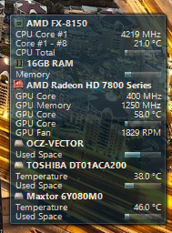

# Quick and Easy Windows Hardware Monitor

Have you ever wondered how much heat is building up inside your pc, or how fast your fans are spinning? There are many tools around to give you this information, including [Samurize](http://www.samurize.com/modules/news/), and [Rainmeter](https://www.rainmeter.net/). While these tools can be extremly powerful and give you plenty of eye candy to watch, they can often take an afternoon simply to configure to your liking. Of course you can always download preconfigured widgets or 'skins' as Rainmeter calls them, but you may not necessarily get all the information you would like, for example I wanted to see how much load was on my gpu, and how hot it was.

I decided to give Rainmeter a shot. It has a very nice interface for adding prebuilt skins and allows you to edit them as necessary. Editing the code has a fairly sharp learning curve as I found out, and could not get a GPU temperature to display properly.

Next up, I tried Samurize. This program seems quite outdated, however, and is designed for an older version of windows, like XP, although some people have gotten it to work.

Another solution I have found and currently am using is  [Open Hardware Monitor](http://openhardwaremonitor.org/), an open source tool which easily detects most hardware, and the details that I wanted. I tested it on Windows 8 (64 Bit) and it worked well, although the program is apparently still in beta.

After downloading, since there is no installer, I simply copied it to my Documents folder. After running (as administrator) it gave me all the information I needed to create a custom widget. Built right into the tool is a desktop gadget. Navigate to View -> Show Gadget. By right clicking the items I wanted displayed (such as GPU core, Memory, etc) followed by Show in Gadget, I could customize my own system monitor in seconds.

Finally, the options menu provides choices to keep the program running when closed, and minimized (so your gadget stays running) and also the option to start automatically with windows. No install, no restart necessary. In addition all your preferences appear to be written to a file within the directory OSM is placed.

According to the site, there is also a linux version available, although it looks like it runs under the wine-mono library so its not a native linux software by any means. For linux users several options exist including the well known and powerful app Conky.

